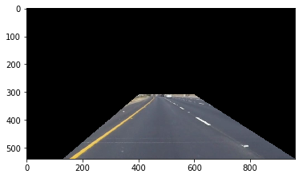
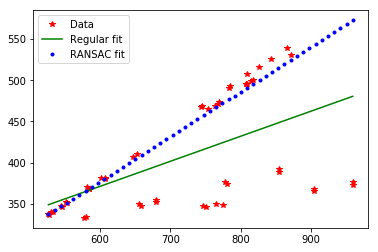

# **Finding Lane Lines on the Road** 

---

The goals / steps of this project are the following:
* Make a pipeline that finds lane lines on the road
* Reflect on your work in a written report

[//]: # (Image References)
---

### Reflection

### 1. Describe your pipeline. As part of the description, explain how you modified the draw_lines() function.

My pipeline consisted of 5 steps. First, I converted the images to grayscale, 

then I use Canny Edge detection method to extract edges from the image. I tuned paramteres to reduce background
noise as much as possible. 

In the next step, I choose to analyze only section of image shown below.

     

Then I run hough tranformation to find out straight lines in the image. 
In order to draw a single line on the left and right lanes, I modified the draw_lines() function by 
seperating lines into two categories, positive slope and negative slope. Lines that have negative slope correspond
to left lane and lines with positive slope correspond to right lines. 

In the next step I fit those two categories separately to straight line. During the initial trial I realized 
I was not able to get perfectly aligned lanes, the reason for that was there were some outliers which detoriated 
slope. To overcome this issue, I used Random Sampling Consensus (RANSAC) algorithm. 

  
Then, extrapolated lines are blended with original image and roi is selected again.

### 2. Identify potential shortcomings with your current pipeline

One potential shortcoming would be what would happen when lanes fall outside of the selected region. 
In that case lanes will be extrapolated from the other features such as some segments of other cars.  

Another shortcoming could be if lanes are curved. Right now, lanes are extrapolated to straight line
which is not good approximation. 

### 3. Suggest possible improvements to your pipeline

A possible improvement would be to automatically detect road itself. If we have general idea of what color
highway raods are we could select region of interest based on the color information. 

Another potential improvement could be to to fit extrated features to non-linear polinomial function. 
In that case we would be able to take into account curved surfaces. 
